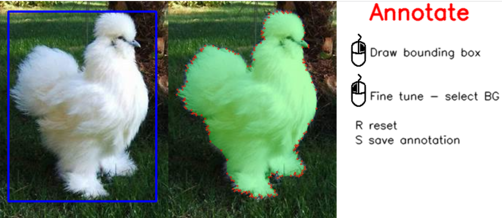
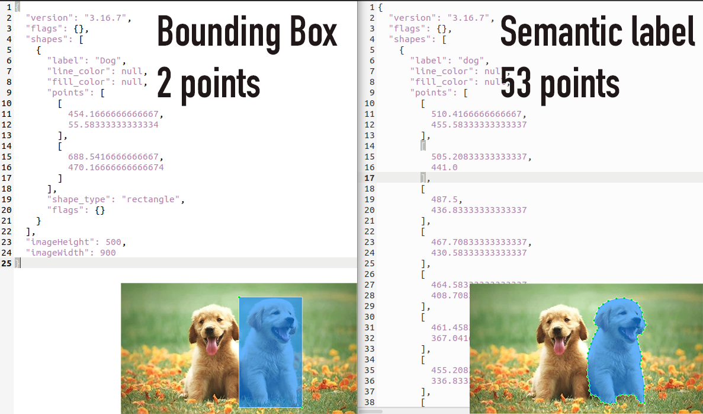

# Box2Seg
Box2Seg is a semantic annotation tool but faster.

# Why another annotation tool

Deep learning-based computer vision models are becoming more prominent with various applications
in medical imaging, automotive, logistics, etc. However, they require a large amount of annotated
data to perform significantly well, and generating annotation labels for these large datasets is
a cumbersome and time-consuming task. Specifically, for segmentation applications generating
annotated data is a relatively difficult task compared to drawing simple bounding boxes for object
detection. For example, bounding box labels require just two points, whereas semantic labels
require a minimum of 20 points, even for a coarse label, as shown in Figure 1 (manually generated
using labelme annotation tool1)

### References
- G. Bradski. The OpenCV Library. Dr. Dobb’s Journal of Software Tools, 2000.

- Robin Del´earde, Camille Kurtz, Philippe Dejean, and Laurent Wendling. Segment my object: A pipeline to extract segmented objects in images based on labels or bounding boxes. In VISIGRAPP (5: VISAPP), pages 618–625, 2021.
  
- Martin Rajchl, Matthew CH Lee, Ozan Oktay, Konstantinos Kamnitsas, Jonathan Passerat-
Palmbach, Wenjia Bai, Mellisa Damodaram, Mary A Rutherford, Joseph V Hajnal, Bernhard
Kainz, et al. Deepcut: Object segmentation from bounding box annotations using convolutional
neural networks. IEEE transactions on medical imaging, 36(2):674–683, 2016.

- Hamid Rezatofighi, Nathan Tsoi, JunYoung Gwak, Amir Sadeghian, Ian Reid, and Silvio
Savarese. Generalized intersection over union: A metric and a loss for bounding box regression.
In Proceedings of the IEEE/CVF conference on computer vision and pattern recognition, pages
658–666, 2019.

- Carsten Rother, Vladimir Kolmogorov, and Andrew Blake. ”GrabCut”. ACM Transactions
on Graphics, 23(3):309–314, August 2004. doi: 10.1145/1015706.1015720. URL https://doi.org/10.1145/1015706.1015720.
